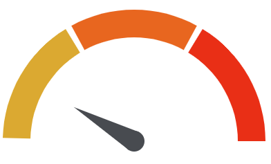

D3 Simple Gauge
===============

A simple gauge written with D3.js that can be easily included in a project.




The base code was used from [this example](https://codepen.io/anon/pen/WKyXgr) on CodePen and from 
[this tutorial](https://jaketrent.com/post/rotate-gauge-needle-in-d3/). I refactored the code of the example to make 
it work with D3.js v5, and I restructured the code to make it more flexible. Thanks to the original author ([Jack Trent](https://github.com/jaketrent)) for its work.

A [demo](https://www.antoinebeland.com/d3-simple-gauge/) of the gauge is available on my personal website.

Quick Start
-----------
The first step you need to do before to use the script is to include [D3.js v5](https://github.com/d3/d3) in your 
project.

Once you have included D3 in your dependencies, you have the following options to use the script:

- Use the latest [version](https://raw.githubusercontent.com/antoinebeland/d3-simple-gauge/master/dist/simple-gauge.js) 
of the master branch (see `dist` folder)
- Clone the repo: `git clone https://github.com/antoinebeland/d3-simple-gauge.git`
- Install with [npm](https://www.npmjs.com/package/d3-simple-gauge): `npm install d3-simple-gauge`

Be sure to include `d3-simple-gauge.js` file in your project before to start.

Usage
-----
The gauge is very simple to use. You only have to initialize a new instance of the gauge with a configuration
like in the following example to make it work. Once the gauge is initialized, you can set the percentage position of
the needle with the `percent` or `value` properties.

```javascript
const svg = d3.select('body')
  .append('svg')
  .attr('width', 400)
  .attr('height', 250);

const simpleGauge = new window.d3SimpleGauge.SimpleGauge({
  animationDelay: 0,          // The delay in ms before to play the needle animation (optional)
  animationDuration: 3000,    // The duration in ms of the needle animation (optional)
  barWidth: 40,               // The bar width of the gauge (optional)
  easeType: d3.easeElastic,   // The ease type to use with the needle animation (optional)
  el: svg.append('g'),        // The element that hosts the gauge
  height: 200,                // The height of the gauge
  interval: [0, 200],         // The interval (min and max values) of the gauge (optional)
  needleRadius: 15,           // The radius of the needle (optional)
  percent: 0.5,               // The initial percentage of he needle (optional)         
  sectionsCount: 2,           // The number of sections in the gauge
  width: 400                  // The width of the gauge
});

setTimeout(() => {
  simpleGauge.percent = 0.7;  // The new percent of the needle to set (70%)
  
  setTimeout(() => {
    simpleGauge.value = 42;  // The new value of the needle to set inside the interval (21%)
  }, 1500);
}, 1500);
```

To apply colors on the gauge, you need to define some CSS classes. There are two classes used to set the needle colors 
(`needle` and `needle-center`), and there is one class for each group generated (`chart-color{i}`), where `{i}` is a 
number between 1 and the groups count, to apply a specific color to a group. You can take a look at the following 
example to know how to use the classes.

```css
/* Fill color for the first group */
.chart-color1 {
  fill: #dea82c;
}

/* Fill color for the second group */
.chart-color2 {
  fill: #e9621a;
}

/* Fill color for the third group */
.chart-color3 {
  fill: #e92213;
}

/* Fill color for the needle */
.needle,
.needle-center {
  fill: #464A4F;
}
```

This script is written in ECMAScript 6 and is transpiled in [UMD](https://github.com/umdjs/umd) format. So, you can 
import it easily as a module. Look at the following examples to know how to import it:

```javascript
import { SimpleGauge } from 'd3-simple-gauge';          // In an ES6 application

const SimpleGauge = window.d3SimpleGauge.SimpleGauge    // In the browser
```

License
-------
The code of this project is under MIT license.
